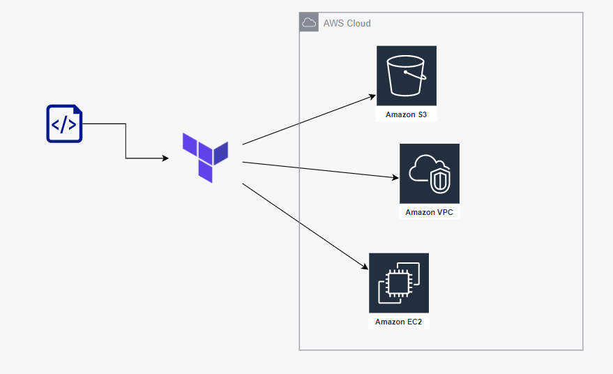

# Terraform AWS with Remote State
This Terraform project is an example of how to create an EC2 instance with remote state and VPC on AWS.

### Requisites
It is necessary to have the following tools installed:

- [Terraform](https://developer.hashicorp.com/terraform/downloads)
- [AWS CLI](https://docs.aws.amazon.com/cli/latest/userguide/getting-started-install.html)

Also, valid AWS credentials are required. You can configure your credentials by running `aws configure` and providing your AWS credentials.

### Directories
This is the project's architecture structure:
```commandline
├── bucket-state
├── vpc-network
└── instance-ec2
```

#### bucket-state
Terraform files to create the bucket that will be used for versioning `.ftstate` files.

#### vpc-network
Files for creating the **VPC**, restrict inbound and outbound traffic and protect instances from unauthorized transit, using ***aws_network_acl*** and ***aws_security_group***.

#### instance-ec2
For creating the EC2 instance.


### How to use
To create the entire infrastructure, run the following command:
```bash
sh ./run_all_steps.sh
```

This command will execute the scripts:
- run_create_bucket_state
  ```bash
    sh ./run_create_bucket_state.sh
  ```
- run_vpc_network
  ```bash
    sh ./run_vpc_network.sh
  ```
- run_ec2_create
  ```bash
    sh ./run_ec2_create.sh
  ```

A `.sh` files are shell script files in **Linux**, containing a set of commands that will be executed in sequence. For example:
1. terraform init
2. terraform validate
3. terraform plan -out <plan_name>
4. terraform apply


### Created resources
This project uses Terraform to create the following infrastructure on AWS.

#### Amazon EC2 Instance
Terraform will create an EC2 instance in the region specified in each `main.tf` file.
The EC2 instance will have the following configurations:
- Instance type: **t2.micro**
- Operating system: **Ubuntu Server 20.04 LTS**
- Storage: **8 GB** of EBS block storage.

#### Amazon VPC
Terraform will create a Virtual Private Cloud (VPC) in the region specified in each file. The VPC will have the following configurations:

- VPC IP address block: 10.0.0.0/16
- A public subnet: 10.0.1.0/24
- A private subnet: 10.0.2.0/24
- Internet Gateway: Terraform will create an Internet Gateway and attach it to the VPC to allow EC2 instances in the public subnet to communicate with the internet.

#### Security Group
Terraform will create a Security Group in the created VPC to allow SSH access to the EC2 instance. The Security Group will have the following settings:

- Rule of input: Allows SSH traffic (port 22) from any IP address.
- Outbound rule: Allows all traffic.

#### Network ACL
The Terraform will create a Network ACL in the created VPC. The Network ACL will have the following configurations:

- Rule of input: It will allow all incoming traffic to the created public subnet.
- Outbound rule: It will allow all outbound traffic in the created public subnet.

#### Amazon S3 Bucket
The Terraform will create an S3 bucket with the name specified in the variables.tf file. The S3 bucket will have the following configurations:

- Name of bucket: `bucket-tfstate-jac`
- Versioning: The bucket will be configured to store multiple versions of an object, allowing you to keep a history of changes. This is useful for the `.tfstate` file that will be created to store the state of the infrastructure provisioned with Terraform.
- Remote state: The `.tfstate` file created by Terraform will be stored in the S3 bucket. This allows infrastructure to be managed by multiple people in different locations, as everyone can access the centralized `.tfstate` file in S3.

When executing the `sh run_all_steps.sh` command, Terraform will create all these resources in your AWS account. After creation, the EC2 instance will have a public IP address that can be used to remotely connect to the instance.

### Notes
Translation: Remember to execute the run_destroy_all.sh script after use to destroy the created infrastructure and avoid additional charges on your AWS account.
```bash
sh ./run_destroy_all.sh
```


